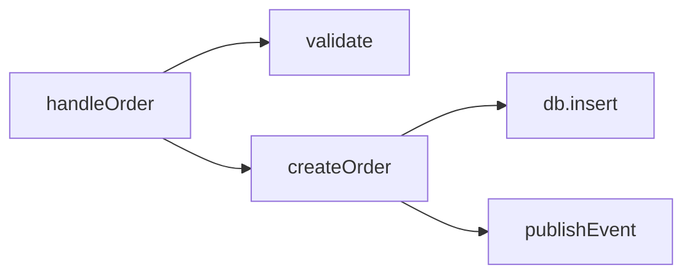
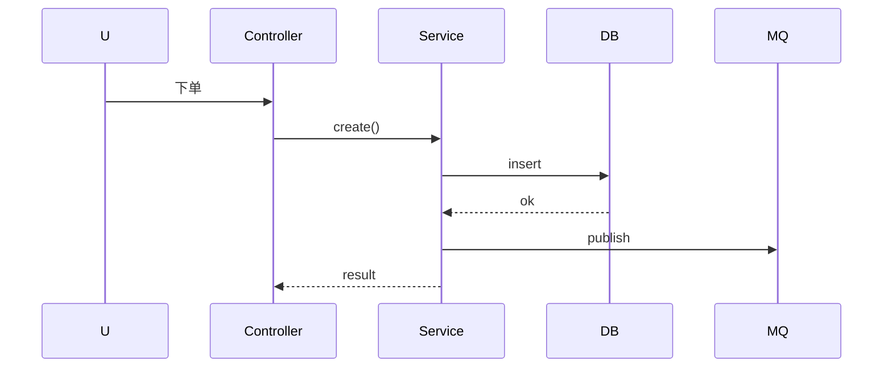

# 代码解读（code-explain）

帮助理解陌生代码。逐层解释"这段代码在做什么、为什么这么做、和谁有关系"，可配合 mermaid 画调用链/流程/时序图。

## 何时触发

- 用户说"解释代码""这个函数干嘛的""读懂这个项目""梳理逻辑""这段什么意思"等
- 用户接手陌生代码库，要快速建立心智模型
- 用户问某个 bug 相关代码的执行流程

## 标准流程

1. **定位代码**：明确要解释的文件/函数/代码块
2. **静态通读**：读代码 + 依赖 + 调用方
3. **分层解释**：先说整体职责，再说逐段逻辑
4. **关系梳理**：调用方/被调用方/数据流
5. **可视化**（可选）：mermaid 画调用链/时序/流程
6. **一句话总结**：这段代码的核心职责

## 解释结构

### 单函数解读
```
## foo(args) — 一句话职责

**输入**：args 各字段含义
**输出**：返回什么、副作用
**流程**：
1. 校验入参
2. 查 DB
3. 转换格式
4. 返回

**调用方**：bar()、baz()
**被调用**：db.query()、transform()
**设计模式**：模板方法
**坑/注意**：XXX 情况会返回空
```

### 模块/项目解读
```
## 整体架构
- 入口：main.ts
- 分层：Controller → Service → Repository
- 数据流：请求 → 鉴权 → 路由 → 业务 → DB → 响应

## 各模块职责
- auth/：登录与鉴权
- order/：订单核心
- pay/：支付对接
```

## 可视化（mermaid）

### 调用链


### 时序


## 快速建立心智模型

1. 找入口（main/index/app）→ 看启动流程
2. 看目录结构 → 推断分层
3. 按一个典型请求/用例走一遍完整路径
4. 找核心数据模型 → 理解领域
5. 看配置/常量 → 理解外部依赖

## 注意事项

- 先讲"做什么"再讲"怎么做"，先整体后细节
- 用业务语言而非纯代码术语（"下单流程"而非"handleOrder 函数"）
- 标注关键分支和边界条件
- 指出历史包袱/技术债/奇怪写法的原因（若能推断）
- 对递归/回调/异步/反射等难懂处重点展开
- 可配合 grep/读取依赖文件追溯调用关系