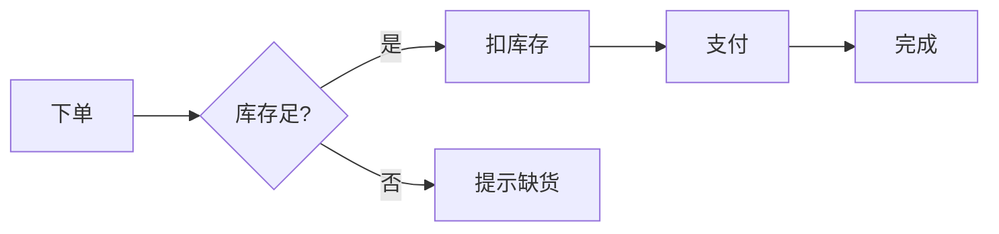
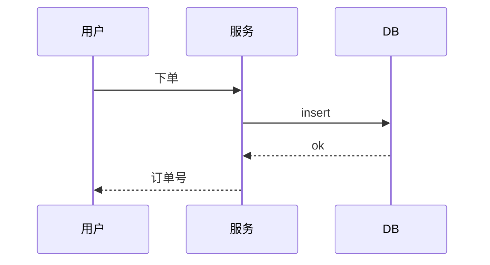
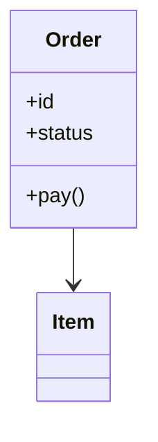

# Markdown 文档写作（markdown-doc）

生成结构清晰、可渲染的 Markdown 文档。覆盖 README、API 文档、技术方案、变更记录、博客，支持 mermaid 图表。

## 何时触发

- 用户说"写文档""写 README""写 API 文档""写技术方案""写博客""整理成文档"等
- 用户要把散乱信息组织成正式文档
- 用户要给项目补 README / CHANGELOG

## 标准流程

1. **定类型与读者**：README（用户）/ API 文档（开发者）/ 方案（评审）/ 博客（公众）
2. **列大纲**：按类型套结构模板
3. **填充内容**：代码示例 + 表格 + 图表
4. **校对渲染**：确保 mermaid/表格/代码块能正确渲染

## 结构模板

### README
```markdown
# 项目名

一句话简介。

## 功能
- 功能 1
- 功能 2

## 快速开始
\`\`\`bash
pnpm install
pnpm dev
\`\`\`

## 配置
| 参数 | 说明 | 默认 |
|------|------|------|

## 开发
\`\`\`bash
pnpm test
\`\`\`

## 许可证
Apache-2.0
```

### API 文档
```markdown
## 接口：创建订单

`POST /v1/orders`

**入参**
| 字段 | 类型 | 必填 | 说明 |
|------|------|------|------|
| items | string[] | 是 | 商品 ID 列表 |

**出参**
\`\`\`json
{ "id": "o_1", "status": "paid" }
\`\`\`

**错误码**
| code | 说明 |
|------|------|
| 40001 | 商品不存在 |
```

### 技术方案
```markdown
# 方案：XX 功能

## 背景
为什么做。

## 目标
要达成什么。

## 方案
### 架构
（mermaid 图）
### 流程
1. ...
### 数据模型
（表）

## 风险与对策
| 风险 | 对策 |
|------|------|

## 排期
- 阶段 1
- 阶段 2
```

## mermaid 图表

### 流程图


### 时序图


### 类图


## 常用元素

- **表格**：对齐用 `|`，表头分隔 `|---|`
- **代码块**：带语言标识 ```ts ```bash
- **目录**：`- [标题](#标题)`（标题转小写、空格转连字符）
- **折叠**：`<details><summary>详情</summary>内容</details>`
- **提示框**（GitHub）：`> [!NOTE]` / `> [!WARNING]`
- **徽章**：``

## 注意事项

- 一级标题（#）每篇只用一次（文档标题）
- 代码块带语言标识，便于高亮
- 表格别太宽，宽表拆成多表或用列表
- mermaid 在 GitHub/语雀/Typora 可渲染，纯文本环境留文字说明兜底
- README 首屏（不滚动可见）要讲清"这是什么、怎么装"，细节往下放
- API 文档每个接口都给请求/响应示例，别只给字段表
- 写完用编辑器预览一遍，确认渲染无误