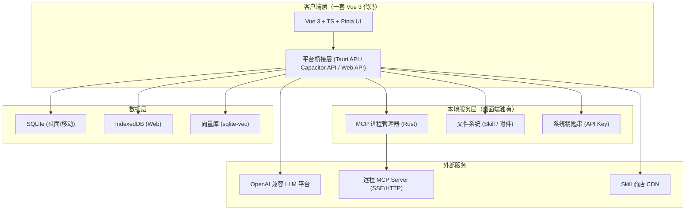
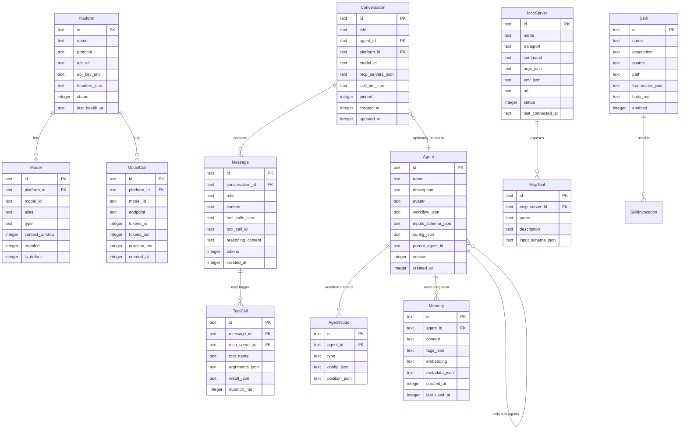

# AI Assistant 技术架构文档

> 项目路径：`C:\Users\yhfys\Desktop\ai-assistant`

## 1. 架构设计



三端共用一套 Vue 3 + TS + Pinia 代码库，通过平台桥接层（`packages/core/src/platform/`）抽象差异：
- 桌面端通过 Tauri 调用 Rust 命令（MCP 子进程、文件、钥匙串、SQLite）
- 移动端通过 Capacitor 插件调用原生能力
- Web 端用浏览器 API 替代（IndexedDB、File System Access API、Web Crypto）

## 2. 技术栈

| 层 | 技术 | 版本 | 选型理由 |
|----|------|------|---------|
| 前端框架 | Vue | 3.5+ | 与 DE-GPT Web UI 一致，可复用经验 |
| 语言 | TypeScript | 5.5+ | 类型安全 |
| 构建 | Vite | 5+ | 快速 HMR |
| 状态 | Pinia | 2+ | Vue 官方推荐 |
| UI 库 | Element Plus | 2.8+ | 与 DE-GPT 一致，组件丰富 |
| 图标 | @element-plus/icons-vue + lucide | latest | 线性风格统一 |
| 路由 | Vue Router | 4+ | 标准 |
| 工作流画布 | Vue Flow | 1+ | 节点画布成熟方案 |
| Markdown | markdown-it + highlight.js + KaTeX | latest | 代码高亮 + 数学公式 |
| MCP SDK | @modelcontextprotocol/sdk | latest | 官方 TS SDK |
| 桌面壳 | Tauri | 2.0+ | 包体小、性能好、原生能力 |
| 移动壳 | Capacitor | 6+ | iOS/Android 一套代码 |
| 数据库 | better-sqlite3 / @capacitor-community/sqlite / Tauri SQL Plugin | latest | 三端统一 SQL 接口 |
| 向量库 | sqlite-vec | latest | SQLite 扩展，零额外服务 |
| HTTP | axios + fetch (SSE) | latest | 流式支持 |
| 包管理 | pnpm | 9+ | monorepo workspace |

## 3. 项目目录结构

```
ai-assistant/
├── apps/                              # 应用入口
│   ├── desktop/                       # Tauri 桌面端
│   │   ├── src-tauri/                 # Rust 后端
│   │   │   ├── src/
│   │   │   │   ├── main.rs
│   │   │   │   ├── commands/          # Tauri 命令
│   │   │   │   │   ├── mcp.rs         # MCP 子进程管理
│   │   │   │   │   ├── fs.rs          # 文件系统
│   │   │   │   │   └── keyring.rs     # 钥匙串
│   │   │   │   └── lib.rs
│   │   │   ├── Cargo.toml
│   │   │   └── tauri.conf.json
│   │   └── package.json
│   ├── mobile/                        # Capacitor 移动端
│   │   ├── capacitor.config.ts
│   │   ├── ios/
│   │   ├── android/
│   │   └── package.json
│   └── web/                           # 纯 Web PWA
│       ├── public/
│       │   └── manifest.json
│       ├── vite.config.ts
│       └── package.json
├── packages/                          # 共享代码
│   ├── ui/                            # 共享 Vue 组件库
│   │   ├── src/
│   │   │   ├── components/
│   │   │   ├── views/
│   │   │   ├── stores/
│   │   │   ├── router/
│   │   │   └── App.vue
│   │   └── package.json
│   ├── core/                          # 业务核心逻辑（平台无关）
│   │   ├── src/
│   │   │   ├── platform/              # 平台抽象接口
│   │   │   │   ├── types.ts
│   │   │   │   ├── desktop.ts         # Tauri 实现
│   │   │   │   ├── mobile.ts          # Capacitor 实现
│   │   │   │   └── web.ts             # Web 实现
│   │   │   ├── db/                    # 数据库层
│   │   │   │   ├── schema.ts          # 表结构定义
│   │   │   │   ├── migrations.ts      # 迁移脚本
│   │   │   │   └── repositories/      # 仓储模式
│   │   │   ├── llm/                   # LLM 调用层
│   │   │   │   ├── client.ts          # OpenAI 兼容客户端
│   │   │   │   ├── stream.ts          # SSE 流式解析
│   │   │   │   └── tools.ts           # 工具调用编排
│   │   │   ├── mcp/                   # MCP 客户端
│   │   │   │   ├── client.ts
│   │   │   │   ├── stdio.ts           # stdio 传输
│   │   │   │   ├── sse.ts             # SSE 传输
│   │   │   │   └── http.ts            # Streamable HTTP
│   │   │   ├── workflow/              # 工作流引擎
│   │   │   │   ├── engine.ts
│   │   │   │   ├── nodes/             # 节点类型
│   │   │   │   └── context.ts
│   │   │   ├── agent/                 # 智能体运行时
│   │   │   │   ├── runner.ts
│   │   │   │   ├── sub-agent.ts
│   │   │   │   └── memory.ts
│   │   │   ├── skill/                 # Skill 管理
│   │   │   │   ├── loader.ts
│   │   │   │   └── market.ts
│   │   │   └── compress/              # 上下文压缩
│   │   │       ├── window.ts          # 滑动窗口
│   │   │       └── summary.ts         # 摘要压缩
│   │   └── package.json
│   └── shared/                        # 类型与工具
│       ├── src/
│       │   ├── types/                 # 全局类型
│       │   └── utils/
│       └── package.json
├── pnpm-workspace.yaml
├── package.json
└── tsconfig.base.json
```

## 4. 路由定义

| 路由 | 页面 | 说明 |
|------|------|------|
| `/chat` | 聊天工作台 | 默认首页 |
| `/chat/:convId` | 指定会话 | 直接打开某会话 |
| `/models` | 模型平台列表 | 平台 + 模型管理 |
| `/models/:platformId` | 平台详情 | 模型表格 |
| `/mcp` | MCP 服务列表 | |
| `/mcp/new` | 新增 MCP 服务 | |
| `/mcp/:id` | MCP 服务详情 | 工具列表 + 日志 |
| `/skills` | Skill 商店 | 商店 + 本地 |
| `/skills/:id` | Skill 详情 | |
| `/skills/new` | 自建 Skill | |
| `/agents` | 智能体列表 | |
| `/agents/:id` | 智能体编辑 | 工作流画布 |
| `/agents/:id/memory` | 智能体记忆 | |
| `/settings` | 设置 | 通用/数据/同步 |

## 5. 数据模型

### 5.1 ER 图



### 5.2 DDL（SQLite）

```sql
-- 平台
CREATE TABLE platform (
  id TEXT PRIMARY KEY,
  name TEXT NOT NULL,
  protocol TEXT NOT NULL DEFAULT 'openai',
  api_url TEXT NOT NULL,
  api_key_enc BLOB NOT NULL,
  headers_json TEXT,
  status INTEGER NOT NULL DEFAULT 1,
  last_health_at TEXT,
  created_at INTEGER NOT NULL
);

-- 模型
CREATE TABLE model (
  id TEXT PRIMARY KEY,
  platform_id TEXT NOT NULL REFERENCES platform(id) ON DELETE CASCADE,
  model_id TEXT NOT NULL,
  alias TEXT,
  type TEXT NOT NULL DEFAULT 'llm',
  context_window INTEGER DEFAULT 4096,
  enabled INTEGER NOT NULL DEFAULT 1,
  is_default INTEGER NOT NULL DEFAULT 0,
  UNIQUE(platform_id, model_id)
);
CREATE INDEX idx_model_platform ON model(platform_id);

-- 会话
CREATE TABLE conversation (
  id TEXT PRIMARY KEY,
  title TEXT NOT NULL,
  agent_id TEXT,
  platform_id TEXT,
  model_id TEXT,
  mcp_servers_json TEXT,
  skill_ids_json TEXT,
  pinned INTEGER NOT NULL DEFAULT 0,
  created_at INTEGER NOT NULL,
  updated_at INTEGER NOT NULL
);
CREATE INDEX idx_conversation_updated ON conversation(updated_at DESC);

-- 消息
CREATE TABLE message (
  id TEXT PRIMARY KEY,
  conversation_id TEXT NOT NULL REFERENCES conversation(id) ON DELETE CASCADE,
  role TEXT NOT NULL,
  content TEXT,
  tool_calls_json TEXT,
  tool_call_id TEXT,
  reasoning_content TEXT,
  tokens INTEGER,
  created_at INTEGER NOT NULL
);
CREATE INDEX idx_message_conv ON message(conversation_id, created_at);

-- 工具调用记录
CREATE TABLE tool_call (
  id TEXT PRIMARY KEY,
  message_id TEXT NOT NULL REFERENCES message(id) ON DELETE CASCADE,
  mcp_server_id TEXT,
  tool_name TEXT NOT NULL,
  arguments_json TEXT,
  result_json TEXT,
  duration_ms INTEGER,
  created_at INTEGER NOT NULL
);
CREATE INDEX idx_toolcall_msg ON tool_call(message_id);

-- MCP 服务
CREATE TABLE mcp_server (
  id TEXT PRIMARY KEY,
  name TEXT NOT NULL,
  transport TEXT NOT NULL,
  command TEXT,
  args_json TEXT,
  env_json TEXT,
  url TEXT,
  status INTEGER NOT NULL DEFAULT 0,
  last_connected_at TEXT,
  created_at INTEGER NOT NULL
);

-- MCP 工具
CREATE TABLE mcp_tool (
  id TEXT PRIMARY KEY,
  mcp_server_id TEXT NOT NULL REFERENCES mcp_server(id) ON DELETE CASCADE,
  name TEXT NOT NULL,
  description TEXT,
  input_schema_json TEXT,
  UNIQUE(mcp_server_id, name)
);
CREATE INDEX idx_mcp_tool_server ON mcp_tool(mcp_server_id);

-- 智能体
CREATE TABLE agent (
  id TEXT PRIMARY KEY,
  name TEXT NOT NULL,
  description TEXT,
  avatar TEXT,
  workflow_json TEXT NOT NULL,
  inputs_schema_json TEXT,
  config_json TEXT,
  parent_agent_id TEXT,
  version INTEGER NOT NULL DEFAULT 1,
  created_at INTEGER NOT NULL,
  updated_at INTEGER NOT NULL
);
CREATE INDEX idx_agent_parent ON agent(parent_agent_id);

-- 智能体节点
CREATE TABLE agent_node (
  id TEXT PRIMARY KEY,
  agent_id TEXT NOT NULL REFERENCES agent(id) ON DELETE CASCADE,
  type TEXT NOT NULL,
  config_json TEXT NOT NULL,
  position_json TEXT NOT NULL
);
CREATE INDEX idx_agent_node_agent ON agent_node(agent_id);

-- 记忆
CREATE TABLE memory (
  id TEXT PRIMARY KEY,
  agent_id TEXT NOT NULL REFERENCES agent(id) ON DELETE CASCADE,
  content TEXT NOT NULL,
  tags_json TEXT,
  embedding BLOB,
  metadata_json TEXT,
  created_at INTEGER NOT NULL,
  last_used_at INTEGER NOT NULL
);
CREATE INDEX idx_memory_agent ON memory(agent_id, last_used_at DESC);

-- Skill
CREATE TABLE skill (
  id TEXT PRIMARY KEY,
  name TEXT NOT NULL,
  description TEXT,
  source TEXT NOT NULL DEFAULT 'local',
  path TEXT,
  frontmatter_json TEXT,
  body_md TEXT,
  enabled INTEGER NOT NULL DEFAULT 1,
  created_at INTEGER NOT NULL
);

-- 模型调用日志
CREATE TABLE model_call (
  id TEXT PRIMARY KEY,
  platform_id TEXT NOT NULL,
  model_id TEXT NOT NULL,
  endpoint TEXT NOT NULL,
  tokens_in INTEGER,
  tokens_out INTEGER,
  duration_ms INTEGER,
  created_at INTEGER NOT NULL
);
CREATE INDEX idx_modelcall_created ON model_call(created_at DESC);

-- sqlite-vec 虚拟表（记忆向量检索）
CREATE VIRTUAL TABLE memory_vec USING vec0(
  memory_id TEXT PRIMARY KEY,
  embedding FLOAT[1536]
);
```

## 6. 核心模块设计

### 6.1 平台抽象层

```typescript
// packages/core/src/platform/types.ts
export interface PlatformAdapter {
  db: DatabaseAdapter;
  fs: FsAdapter;
  mcp?: McpProcessAdapter;
  keyring: KeyringAdapter;
  platform: 'desktop' | 'mobile' | 'web';
}
```

每个端在 `apps/{desktop,mobile,web}/src/platform.ts` 实例化对应 adapter 注入 UI 层。

### 6.2 LLM 客户端

完全遵循 OpenAI 协议，三个端点：

```typescript
// packages/core/src/llm/client.ts
export class LlmClient {
  constructor(private platform: Platform, private model: Model) {}

  async *chatStream(messages: Message[], tools?: Tool[]): AsyncIterable<ChatChunk> {
    const res = await fetch(`${this.platform.apiUrl}/v1/chat/completions`, {
      method: 'POST',
      headers: this.buildHeaders(),
      body: JSON.stringify({
        model: this.model.modelId,
        messages, tools, stream: true,
      }),
    });
    return parseSSE(res.body);
  }

  async embeddings(input: string[]): Promise<number[][]> { /* ... */ }
  async listModels(): Promise<Model[]> { /* GET /v1/models */ }
}
```

### 6.3 MCP 客户端

```typescript
// packages/core/src/mcp/client.ts
export class McpClient {
  constructor(private transport: 'stdio' | 'sse' | 'http', private config: McpServerConfig) {}

  async connect(): Promise<void> { /* 建立 transport */ }
  async listTools(): Promise<McpTool[]> { /* JSON-RPC tools/list */ }
  async callTool(name: string, args: unknown): Promise<ToolResult> { /* JSON-RPC tools/call */ }
  async disconnect(): Promise<void> { /* 关闭 */ }
}
```

stdio 传输在桌面端通过 Tauri Rust 命令启动子进程并管道 stdin/stdout；Web/移动端仅支持 sse/http。

### 6.4 工作流引擎

```typescript
// packages/core/src/workflow/engine.ts
export class WorkflowEngine {
  async run(agent: Agent, inputs: Record<string, unknown>): Promise<RunResult> {
    const sorted = topologicalSort(agent.workflow.nodes, agent.workflow.edges);
    const context = new RunContext(inputs);

    for (const node of sorted) {
      const handler = this.handlers[node.type];
      context.set(node.id, await handler.execute(node.config, context));
    }
    return context.finalize();
  }
}

type NodeHandler = {
  type: 'llm' | 'tool' | 'condition' | 'loop' | 'sub_agent' | 'memory';
  execute(config: NodeConfig, ctx: RunContext): Promise<NodeResult>;
};
```

### 6.5 上下文压缩策略

```typescript
// packages/core/src/compress/window.ts
export class ContextWindow {
  constructor(
    private maxTokens: number,        // 默认 8000
    private keepRecent: number,       // 保留最近 N 条，默认 6
    private summaryModel: Model,      // 摘要用的模型
  ) {}

  async compress(messages: Message[]): Promise<Message[]> {
    if (this.tokenCount(messages) <= this.maxTokens) return messages;

    const toCompress = messages.slice(0, -this.keepRecent);
    const toKeep = messages.slice(-this.keepRecent);

    const summary = await this.summarize(toCompress);

    return [
      { role: 'system', content: `前文摘要：${summary}` },
      ...toKeep,
    ];
  }
}
```

## 7. 平台桥接实现

### 7.1 桌面（Tauri）

```rust
// apps/desktop/src-tauri/src/commands/mcp.rs
#[tauri::command]
async fn mcp_start(server_id: String, command: String, args: Vec<String>, env: HashMap<String, String>)
  -> Result<ChildId, String> {
    // 用 tokio::process::Command 启动子进程
}

#[tauri::command]
async fn mcp_call(child_id: ChildId, method: String, params: Value) -> Result<Value, String> {
    // 通过 JSON-RPC 调用子进程
}
```

### 7.2 移动（Capacitor）

```typescript
// apps/mobile/src/platform.ts
import { Capacitor } from '@capacitor/core';
import { CapacitorSQLite } from '@capacitor-community/sqlite';

export const mobileAdapter: PlatformAdapter = {
  platform: 'mobile',
  db: new CapacitorSqliteDatabase(CapacitorSQLite),
  fs: new CapacitorFilesystem(),
  keyring: new CapacitorSecureStorage(),
  mcp: undefined, // MCP stdio 不支持
};
```

### 7.3 Web（PWA）

```typescript
// apps/web/src/platform.ts
export const webAdapter: PlatformAdapter = {
  platform: 'web',
  db: new DexieDatabase('ai-assistant'),
  fs: new FileSystemAccessAdapter(),
  keyring: new WebCryptoKeyring(),
  mcp: undefined,
};
```

## 8. 安全设计

- **API Key 存储**：
  - 桌面：Tauri keyring 插件调用系统钥匙串
  - 移动：Capacitor SecureStorage 插件
  - Web：Web Crypto API 用用户密码派生密钥加密存 IndexedDB
- **MCP 子进程沙箱**：桌面端 MCP 子进程继承 Tauri 进程的权限，无额外降权；后续可加 seccomp/AppContainer
- **远程 MCP 鉴权**：支持 Bearer Token / 自定义 Header
- **Skill 代码执行**：Skill 仅为 Markdown 模板，不含可执行代码；若需脚本则通过 MCP 工具调用
- **CORS**：Web 端通过 Tauri/Capacitor 的 HTTP 代理绕过浏览器 CORS 限制

## 9. 构建与发布

### 9.1 开发

```bash
pnpm install

# 启动 Web 开发（最快）
pnpm --filter @ai-assistant/web dev

# 启动桌面开发（含 Tauri）
pnpm --filter @ai-assistant/desktop dev

# 启动移动开发（需 Xcode/Android Studio）
pnpm --filter @ai-assistant/mobile dev
```

### 9.2 打包

```bash
# 桌面（Windows msi / macOS dmg / Linux AppImage）
pnpm --filter @ai-assistant/desktop build

# 移动
pnpm --filter @ai-assistant/mobile build:ios
pnpm --filter @ai-assistant/mobile build:android

# Web PWA
pnpm --filter @ai-assistant/web build
```

## 10. 关键依赖清单

```json
{
  "dependencies": {
    "vue": "^3.5.0",
    "vue-router": "^4.4.0",
    "pinia": "^2.2.0",
    "element-plus": "^2.8.0",
    "@element-plus/icons-vue": "^2.3.0",
    "@vue-flow/core": "^1.41.0",
    "@modelcontextprotocol/sdk": "^1.0.0",
    "markdown-it": "^14.0.0",
    "highlight.js": "^11.10.0",
    "katex": "^0.16.0",
    "axios": "^1.7.0",
    "better-sqlite3": "^11.0.0",
    "sqlite-vec": "^0.1.0",
    "dexie": "^4.0.0",
    "lucide-vue-next": "^0.460.0"
  },
  "devDependencies": {
    "vite": "^5.4.0",
    "vue-tsc": "^2.1.0",
    "typescript": "^5.6.0",
    "@tauri-apps/cli": "^2.0.0",
    "@capacitor/cli": "^6.0.0"
  }
}
```
